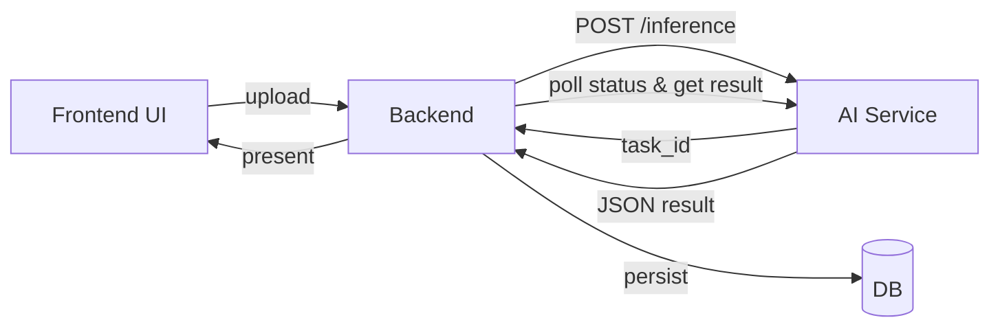

# Planevo (Planning Evolution)
Serwis webowy przeznaczony do zarządzania i kontrolowania osobistych wydatków.

## 📖 Opis projektu
Planevo to system do nowoczesnego zarządzania i kontrolowania finansów osobistych, który opiera się na przetwarzaniu obrazów paragonów i ekstrakcji kluczowych danych (data, sklep, pozycje z cenami, suma). Projekt powstał z myślą o przyspieszeniu i automatyzacji tego procesu, zachęcając użytkowników do regularnej kontroli wydatków. 💸
  
> "Mądre gospodarowanie pieniędzmi to sztuka minimalizowania tylko tych kosztów, które są nam zbędne, po to żeby mieć więcej pieniędzy na to, co jest dla nas ważne."
> (Michał Szafrański, Finansowy Ninja)

## 🎯 Cele projektu
- **Automatyczny odczyt paragonów** — ekstrakcja kluczowych danych (data, sklep, pozycje z cenami, suma) bez ręcznego przepisywania
- **Standaryzacja danych** — ustrukturyzowany JSON gotowy do analizy i kategoryzacji wydatków
- **Bezpieczeństwo i prywatność** — przetwarzanie tylko niezbędnych danych oraz komunikacja po HTTPS
- **Prosta integracja** — jasne kontrakty API (upload/status/result) do wpięcia serwisu AI w mikroserwisy finansowe
- **Skalowalność** — gotowość do wersjonowania modeli i dalszej optymalizacji latencji oraz jakości
- **Lepsza kontrola budżetu** — realne wsparcie w regularnym budżetowaniu i podejmowaniu decyzji finansowych

## 🧰 Kluczowe funkcje
- **Responsywny design** — wygodna obsługa na telefonie, tablecie i komputerze
- **Intuicyjna nawigacja** — szybki dostęp do najważniejszych widoków i filtrów
- **Ciemny i jasny motyw** — komfort pracy w różnych warunkach oświetleniowych
- **Automatyczna kategoryzacja wydatków** — przypisywanie do kategorii na podstawie pozycji z paragonu
- **Tworzenie i monitorowanie budżetów** — cele kwotowe, postęp i limity
- **Miesięczne podsumowania** — zestawienia wydatków w ujęciu okresowym
- **Wykresy i statystyki** — wizualizacja trendów i struktury kosztów
- **Informacje o stanie budżetów** — podgląd realizacji limitów
- **Filtrowanie** — po kategoriach, datach i kwotach
- **Wyszukiwanie tekstowe** — szybkie odnajdywanie transakcji
- **Eksport wydatków (JSON)** — wyprowadzanie danych do dalszej analizy
- **Historia transakcji** — pełny rejestr operacji
- **Automatyczne przypisywanie kategorii użytkownika** — mapowanie do własnych kategorii
- **Własne kategorie** — tworzenie i edycja dopasowanych tagów wydatków

## 🏗️ Architektura Systemu Planevo
!!!!!!!!!!!!!!!! Architektura Systemu Planevo zostala podzielona na 4 glowne mikrosserwisy.....!!!!!!!!!!!!!!!!!
  
### Frontend (Next.js)
Aplikacja oparta o Next.js (App Router), podzielona na sekcje:
- **Uwierzytelnianie** – logowanie i rejestracja użytkownika
- **Autoryzacja** – ochrona zasobów i ról
- **Panel główny** – podsumowania, wykresy, szybkie akcje
- **Wydatki** – przegląd, edycja i filtrowanie transakcji
- **Budżety** – tworzenie, monitoring i limity
- **Paragony** – przesyłanie nowych i podgląd przetworzonych paragonów
- **Planowanie** – tworzenie nowego budżetu

#### Struktura
```bash
/frontend
├─ app/          
│  ├─ components/
│  │  ├─ budgets/
│  │  ├─ dashboard/
│  │  ├─ expenses/
│  │  ├─ home/
│  │  ├─ planning/
│  │  ├─ AuthenticationLayout.tsx
│  │  ├─ Header.tsx
│  │  ├─ Footer.tsx
│  ├─ budgets/
│  │  ├─ page.tsx
│  │  ├─ layout.tsx
│  ├─ receipts/
│  ├─ dashboard/
│  ├─ expenses/
│  ├─ login/
│  ├─ planning/
│  ├─ profile/
│  ├─ register/
│  ├─ types/
│  ├─ utils/
│  ├─ contexts/
│  ├─ hooks/
│  ├─ lib/
│  ├─ global.css
│  ├─ layout.tsx
│  ├─ page.tsx
```
  
### Backend (Spring Boot – mikroserwisy)
Backend składa się z kilku niezależnych mikroserwisów

#### Auth Service
Serwis odpowiedzialny za autoryzację i uwierzytelnianie użytkowników:
- **Controller** – żądania HTTP dot. logowania/rejestracji/odświeżania
- **Service** – logika autoryzacji/uwierzytelniania
- **Model** – encje użytkowników i tokenów
- **Repository** – dostęp do danych
- **Security** – JWT + Spring Security
- **ValidationServcie** – walidacja danych z requestów
- **MetricsService** – metryki serwisu
- **JwtService** – generowanie i weryfikacja tokenów

#### Finance Service
Główny serwis odpowiedzialny za zarządzanie finansami:
- **Controller** – obsługa żądań HTTP
- **Service** – logika biznesowa
- **Model** – encje + DTO
- **Repository** – warstwa dostępu do DB
- **Exception** – obsługa wyjątków
- **ValidationServcie** – walidacja danych
- **MetricsService** – metryki serwisu

#### Gateway Service (API Gateway)
API Gateway pełniący rolę punktu wejścia do systemu:
- **Routing** – kierowanie żądań do odpowiednich serwisów
- **Filtry** – wstępna autoryzacja i nagłówki
- **Rate limiting** – ochrona przed nadużyciami
- **CORS** – obsługa cross-origin requests

#### Struktura
```bash
/backend/finance/
├─ src/
│   ├─ main/
│   │   ├─ java/
│   │   │   └─ com/receipts/finance/
│   │   │       ├─ FinanceApplication.java
│   │   │       ├─ config/
│   │   │       │   └─ OpenApiConfig.java
│   │   │       ├─ controller/
│   │   │       │   ├─ BudgetController.java
│   │   │       │   ├─ CategoryController.java
│   │   │       │   ├─ DashBoardController.java
│   │   │       │   ├─ ExpenseController.java
│   │   │       │   └─ ReceiptController.java
│   │   │       ├─ exception/
│   │   │       │   ├─ ConflictException.java
│   │   │       │   ├─ ErrorResponse.java
│   │   │       │   ├─ ForbiddenException.java
│   │   │       │   ├─ NotFoundException.java
│   │   │       │   ├─ GlobalExceptionHandler.java
│   │   │       │   ├─ NoContentException.java
│   │   │       │   └─ ValidationException.java
│   │   │       ├─ model/
│   │   │       │   ├─ BoxCoors.java
│   │   │       │   ├─ Budget.java
│   │   │       │   ├─ Category.java
│   │   │       │   ├─ Expense.java
│   │   │       │   ├─ Receipt.java
│   │   │       │   ├─ User.java
│   │   │       │   └─ dto/
│   │   │       │       ├─ AlertsAndNotificationsDTO.java
│   │   │       │       ├─ BudgetDTO.java
│   │   │       │       ├─ BudgetRequestDTO.java
│   │   │       │       ├─ CategoryDTO.java
│   │   │       │       ├─ CategoryRequestDTO.java
│   │   │       │       ├─ DashboardDTO.java
│   │   │       │       ├─ ExpenseDTO.java
│   │   │       │       ├─ ExpenseRequestDTO.java
│   │   │       │       ├─ ReceiptDTO.java
│   │   │       │       ├─ ReceiptRequestDTO.java
│   │   │       │       ├─ UserDTO.java
│   │   │       │       └─ dashboard/
│   │   │       │           ├─ CategoryBreakdownDTO.java
│   │   │       │           ├─ MonthlyExpenseDTO.java
│   │   │       │           ├─ RecentExpenseDTO.java
│   │   │       │           ├─ TotalExpenseDTO.java
│   │   │       │           ├─ TotalIncomeDTO.java
│   │   │       │           ├─ TotalSavingsDTO.java
│   │   │       │           ├─ WeeklyExpenseDTO.java
│   │   │       │           └─ YearlyExpenseDTO.java
│   │   │       │       └─ publicdto/
│   │   │       │           ├─ ExpenseExportDTO.java
│   │   │       │           └─ ExportDTO.java
│   │   │       ├─ repository/
│   │   │       │   ├─ budget/
│   │   │       │   │   ├─ BudgetRepository.java
│   │   │       │   │   ├─ BudgetRepositoryCustom.java
│   │   │       │   │   └─ BudgetRepositoryCustomImpl.java
│   │   │       │   ├─ CategoryRepository.java
│   │   │       │   ├─ expense/
│   │   │       │   │   ├─ ExpenseRepository.java
│   │   │       │   │   ├─ ExpenseRepositoryCustom.java
│   │   │       │   │   └─ ExpenseRepositoryCustomImpl.java
│   │   │       │   └─ UserRepository.java
│   │   │       ├─ service/
│   │   │       │   ├─ BudgetService.java
│   │   │       │   ├─ BudgetServiceImpl.java
│   │   │       │   ├─ CategoryService.java
│   │   │       │   ├─ CategoryServiceImpl.java
│   │   │       │   ├─ DashBoardService.java
│   │   │       │   ├─ DashBoardServiceImpl.java
│   │   │       │   ├─ ExpenseService.java
│   │   │       │   ├─ ExpenseServiceImpl.java
│   │   │       │   ├─ ReceiptService.java
│   │   │       │   ├─ ReceiptServiceImpl.java
│   │   │       │   ├─ UserService.java
│   │   │       │   └─ UserServiceImpl.java
│   │   │       └─ util/
│   │   │           └─ Utils.java
│   │   └─ resources/
│   │       └─ application.yml
```

### AI Service (Python/FastAPI) — Receipt Processing
Serwis odpowiedzialny za cały pipeline CV/OCR, post-processing oraz zwrot ustrukturyzowanego JSON:
- **Field detection** – deterministyczny algorytm wykrywania i przycinania obszaru paragonu
- **Block detection** – detekcja sekcji: sklep, produkty, data, suma, NIP
- **OCR routing** – wybór modelu OCR zależnie od sekcji (EasyOCR / Google Vision / Mistral)
- **Parowanie pozycji** – deterministyczny alogrytm filtrowania oraz scalania produktów i cen
- **Post-processing (LLM)** – korekty, walidacje i ujednolicenie formatu
- **API** – końcówki do uruchomienia zadania, sprawdzania statusu i pobrania wyniku

#### Endpointy
- `POST /process-receipt` — przetworzenie paragonu w przypadku zalogowanego użytkownika
- `POST /public-process-receipt` — testowe przetworzenie paragonu dla nowych użytkowników

#### Struktura
```bash
/receipt_processing
├─ config/
│  ├─ config_loader.py
│  └─ receipt_processing_config.py
├─ errors/
│  ├─ exceptions.py
│  ├─ handlers.py
│  └─ logger.py
├─ src/
│  ├─ block_detection/
│  │  ├─ model/
│  │  │  └─ block_detector_v1.pt
│  │  └─ block_det_model.py
│  ├─ field_detection/
│  │  └─ receipt_field_detection.py
│  ├─ ocr_service/
│  │  ├─ services/
│  │  │  ├─ base.py
│  │  │  ├─ easyocr_service.py
│  │  │  ├─ google_service.py
│  │  │  └─ mistral_service.py
│  │  ├─ utils/
│  │  │  ├─ google_service_utils.py
│  │  │  ├─ image_processing.py
│  │  └─ ocr_service.py
│  ├─ post_processing_service/
│  │  ├─ clients/
│  │  │  ├─ openai_client.py
│  │  │  └─ receiptdb_client.py
│  │  └─ post_processing_service.py
│  └─ receipt_processing_service.py
├─ main.py
```




dopisac dalsze rozwijanie aplikacji
