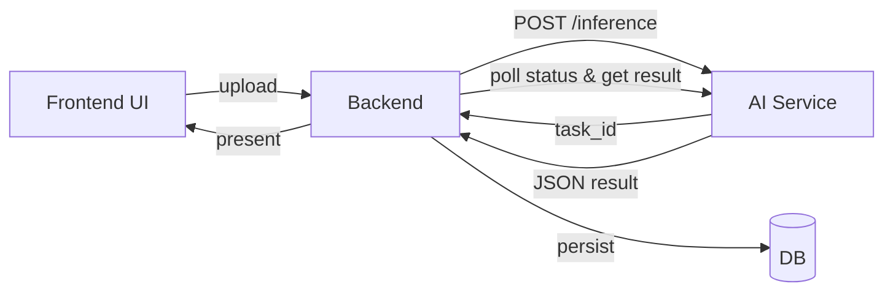

# Planevo (Planning Evolution)
Serwis webowy przeznaczony do zarządzania i kontrolowania osobistych wydatków.

## 📖 Opis projektu
Planevo to system do nowoczesnego zarządzania i kontrolowania finansów osobistych, który opiera się na przetwarzaniu obrazów paragonów i ekstrakcji kluczowych danych (data, sklep, pozycje z cenami, suma). Projekt powstał z myślą o przyspieszeniu i automatyzacji tego procesu, zachęcając użytkowników do regularnej kontroli wydatków. 💸
  
> "Mądre gospodarowanie pieniędzmi to sztuka minimalizowania tylko tych kosztów, które są nam zbędne, po to żeby mieć więcej pieniędzy na to, co jest dla nas ważne."
> (Michał Szafrański, Finansowy Ninja)

## 🎯 Cele projektu
- **Automatyczny odczyt paragonów** — ekstrakcja kluczowych danych (data, sklep, pozycje z cenami, suma) bez ręcznego przepisywania.
- **Standaryzacja danych** — ustrukturyzowany JSON gotowy do analizy i kategoryzacji wydatków.
- **Bezpieczeństwo i prywatność** — przetwarzanie tylko niezbędnych danych oraz komunikacja po HTTPS.
- **Prosta integracja** — jasne kontrakty API (upload/status/result) do wpięcia serwisu AI w mikroserwisy finansowe.
- **Skalowalność** — gotowość do wersjonowania modeli i dalszej optymalizacji latencji oraz jakości.
- **Lepsza kontrola budżetu** — realne wsparcie w regularnym budżetowaniu i podejmowaniu decyzji finansowych.

## 🧰 Kluczowe funkcje
- **Responsywny design** — wygodna obsługa na telefonie, tablecie i komputerze.
- **Intuicyjna nawigacja** — szybki dostęp do najważniejszych widoków i filtrów.
- **Ciemny i jasny motyw** — komfort pracy w różnych warunkach oświetleniowych.
- **Automatyczna kategoryzacja wydatków** — przypisywanie do kategorii na podstawie pozycji z paragonu.
- **Tworzenie i monitorowanie budżetów** — cele kwotowe, postęp i limity.
- **Miesięczne podsumowania** — zestawienia wydatków w ujęciu okresowym.
- **Wykresy i statystyki** — wizualizacja trendów i struktury kosztów.
- **Informacje o stanie budżetów** — podgląd realizacji limitów.
- **Filtrowanie** — po kategoriach, datach i kwotach.
- **Wyszukiwanie tekstowe** — szybkie odnajdywanie transakcji.
- **Eksport wydatków (JSON)** — wyprowadzanie danych do dalszej analizy.
- **Historia transakcji** — pełny rejestr operacji.
- **Automatyczne przypisywanie kategorii użytkownika** — mapowanie do własnych kategorii.
- **Własne kategorie** — tworzenie i edycja dopasowanych tagów wydatków.

## 🧭 Kontekst systemu

### 🧱 Warstwy rozwiązania
- 💻 **Frontend (Next.js/React)** — interfejs użytkownika: upload paragonu, podgląd wyników, budżety, statystyki.
- 🧪 **AI Service (Python/FastAPI)** — pipeline CV/OCR + post-processing LLM; zwraca ustrukturyzowany JSON.
- 🧰 **Backend (Spring Boot, mikroserwisy + API Gateway)** — autoryzacja, logika finansowa, integracja z AI.
- 🗄️ **Storage/DB** — tymczasowe pliki (obrazy paragonów), dane wynikowe (JSON z ekstrakcją), metadane użytkownika i budżetów przechowywane w MongoDB.

dopisac dalsze rozwijanie aplikacji
